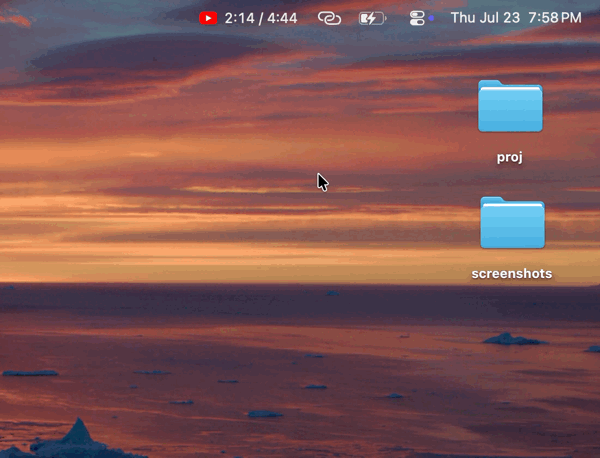

## YTBar

A tiny macOS menu bar app that shows the **playback position of the YouTube video playing in Google Chrome** — `12:34 / 1:02:45`, updating live. Open the menu for a preview frame of the video; click it to jump straight to the Chrome tab. When nothing's playing, it rests on the YouTube play-button logo. Lightweight, no window, no dock icon.

> Built for lofi/long-video sessions: tab away and still see, at a glance, how far into the video you are.



---

## What it shows

- **Playing** — `current / total` time in the menu bar (monospaced, e.g. `12:34 / 1:02:45`), advancing smoothly.
- **Paused** — the same time, dimmed with a `⏸` prefix.
- **Nothing playing / Chrome closed** — rests on the red YouTube logo.

Open the menu while a video plays for a **preview image**. Click it to raise Chrome, select the tab, and bring it to the front.

Everything is controlled from the menu:

- **Show timer** — toggle the `current / total` clock.
- **Preview** — choose the preview image:
  - **Thumbnail** — the video's official thumbnail.
  - **Mid-video frame** — a frame from ~50% of the video (from YouTube's own storyboard images; falls back to the thumbnail when unavailable).
- **Color** — **Red** (the YouTube logo) or **System** (adaptive black/white to match the menu bar).

## How it works

The app watches Chrome via in-process AppleScript (no `osascript` spawning): one batched Apple Event enumerates tabs, then it caches the YouTube tab and probes its `<video>` element (`currentTime` / `duration` / `paused`) about once a second, interpolating locally in between so the clock stays smooth. It does **nothing** while Chrome isn't running, and polls slower while paused.

If multiple YouTube tabs are open, it tracks the one actually playing.

## Requirements & first-run setup

- macOS 12+
- Google Chrome

Two one-time grants are needed for Chrome to answer:

1. **Automation permission** — on first run macOS prompts to let YTBar control Chrome; click **Allow**. (If missed, the menu shows *Allow Automation for YTBar…*, which opens System Settings ▸ Privacy & Security ▸ Automation.)
2. **Chrome ▸ View ▸ Developer ▸ Allow JavaScript from Apple Events** — enable this once so the widget can read the player state. (The menu tells you if it's off.)

## Build

```bash
./build.sh            # builds build/YTBar.app
open build/YTBar.app
```

Pass `--dmg` to package a signed/notarized disk image (requires a Developer ID cert; otherwise the app is ad-hoc signed for local use).

## Notes

Preview images and the player state come from Chrome / YouTube directly; the app makes no other network calls. This is an unofficial personal project, not affiliated with or endorsed by YouTube or Google; "YouTube" and its logo are trademarks of Google, used here nominatively.

## Contributing

Issues and pull requests are welcome — see [CONTRIBUTING.md](CONTRIBUTING.md) for how to build and what fits the project's scope.

## License

MIT — see [LICENSE](LICENSE).
